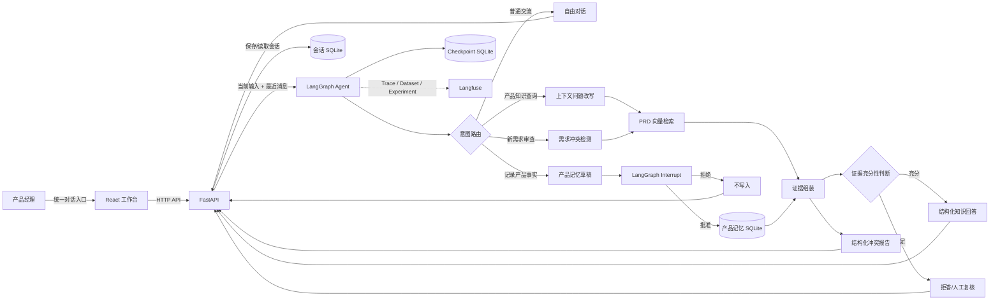
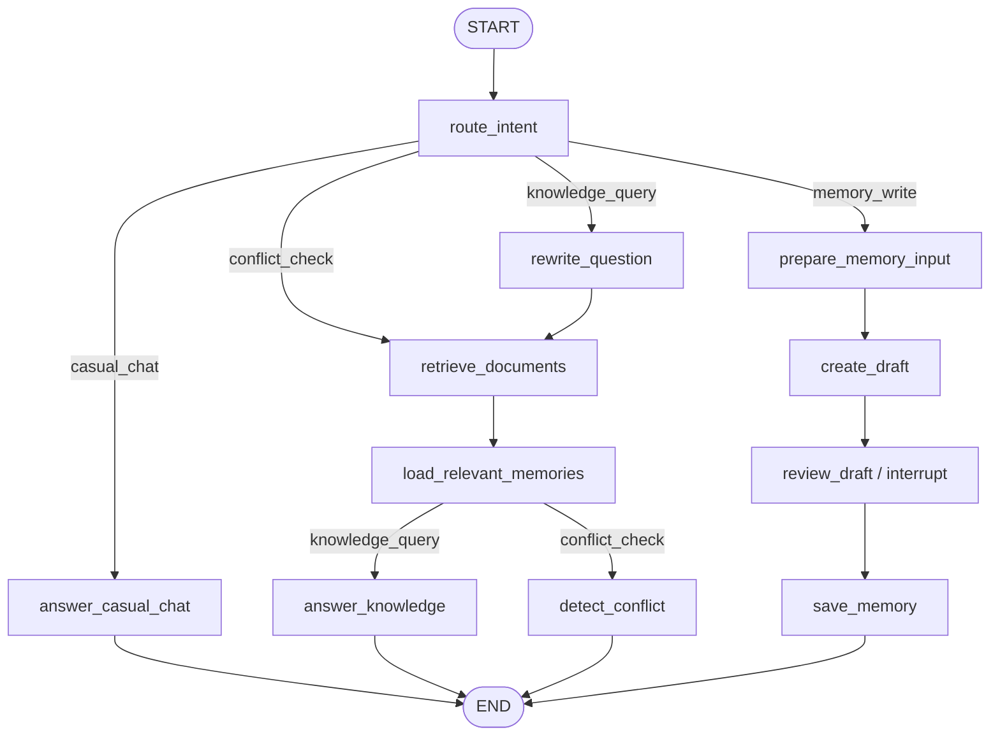

# 产品知识与决策记忆 Agent


一个面向产品经理的产品知识工作台，用于检索历史 PRD、回答设计问题、检测新需求与历史方案的冲突，并通过人工审批维护显式产品记忆。

> 这个项目的重点不是做一个“大而全”的通用 Agent，而是验证产品经理在需求管理场景中真正需要的 AI 能力：历史知识检索、决策追溯、冲突发现、人工确认和可评测迭代。

## 为什么做

产品团队在长期迭代中会积累大量 PRD、评审记录和临时决策。随着需求数量增加，团队经常遇到：

- 忘记历史需求为什么这样设计。
- 新需求和旧方案存在冲突，直到研发或测试阶段才暴露。
- 文档里写的是“规划”，但当前真实实施状态可能已经变化。
- 重要结论散落在聊天、会议和个人记忆里，难以沉淀为团队资产。

因此，本项目将历史 PRD 和人工确认的产品记忆结合起来，构建一个可观察、可评测、可迭代的产品知识 Agent。

## 核心能力

| 能力 | 说明 |
| --- | --- |
| 历史 PRD 问答 | 基于需求文档检索相关片段，生成带引用的回答 |
| 多轮指代追问 | 使用当前会话最近消息进行问题改写，例如把“那前台怎么展示？”补全为独立问题 |
| 需求冲突检测 | 判断新需求是否与历史设计、产品约束或已审批记忆冲突 |
| 显式产品记忆 | 将“当前事实/状态/决策”结构化保存，和原始 PRD 区分开 |
| 人工审批 | 记忆写入前触发 Human-in-the-loop，审批通过才进入产品记忆库 |
| 可观测链路 | 使用 Langfuse 记录路由、检索、模型调用、输出和评测结果 |
| Web 工作台 | 使用统一对话入口展示 Agent 回复、执行路径、证据、记忆和冲突详情 |

## 系统架构



## Agent 工作流



## 三类记忆

| 类型 | 存储位置 | 是否跨对话共享 | 作用 |
| --- | --- | --- | --- |
| 会话上下文 | `web_app.sqlite` | 否 | 保存当前对话消息，最近消息进入路由、自由对话和问题改写 |
| 产品显式记忆 | `product_memories.sqlite` | 是 | 保存经人工审批的产品状态、决策、约束和历史事实 |
| 工作流状态 | `web_checkpoints.sqlite` | 按 `thread_id` 恢复 | 保存 LangGraph 节点状态和 Interrupt，支持审批流程恢复 |

设计上，聊天历史不会自动变成长期事实。只有经过人工审批的内容，才会写入全局产品记忆库，避免把临时讨论、误解或模型推断污染成产品事实。

## 技术栈

- **Agent 编排**：LangGraph
- **模型与工具链**：LangChain、OpenAI-compatible API、Qwen Chat / Embedding
- **检索增强**：PRD 解析、文本切分、Embedding、In-memory Vector Store
- **数据存储**：SQLite 会话库、Checkpoint 库、产品记忆库
- **观测与评测**：Langfuse Tracing、Dataset、Experiment、LLM Judge
- **Web Demo**：FastAPI + React + Vite

## 评测设计

项目使用 Langfuse 搭建 Tracing、Dataset 与 Experiment 评测闭环，数据集覆盖：

- 历史需求问答
- 无答案拒答
- 多轮指代追问
- 普通对话
- 需求冲突检测

评测指标包括：

- `intent_accuracy`：意图路由是否正确。
- `source_recall`：预期来源文档是否被检索命中。
- `refusal_accuracy`：证据不足时是否正确拒答。
- `review_accuracy`：是否正确标记需要人工复核。
- `key_point_coverage`：回答是否覆盖标准要点。
- `groundedness`：回答事实是否能被检索证据支持。

一次典型迭代中，项目通过失败样本定位到“相关资料被误认为充分资料”的问题，并增加独立的证据充分性门控，降低越界推断风险。

## 快速开始

> 以下命令以 Windows PowerShell 为例。

### 1. 安装 Python 依赖

```powershell
python.exe -m pip install -e .
```

### 2. 安装前端依赖并构建

```powershell
cd product_memory_agent\web
npm install
npm run build
cd ..\..
```

### 3. 配置环境变量

在项目根目录创建 `.env`：

```env
OPENAI_API_KEY=your-key
OPENAI_BASE_URL=
CHAT_MODEL=
EMBEDDING_MODEL=

LANGFUSE_ENABLED=false
LANGFUSE_PUBLIC_KEY=
LANGFUSE_SECRET_KEY=
LANGFUSE_HOST=https://cloud.langfuse.com
```

如果需要开启 Langfuse，将 `LANGFUSE_ENABLED` 改为 `true`，并填写 Langfuse API Key。

### 4. 启动 Web Demo

```powershell
.\.venv\Scripts\python.exe -m uvicorn product_memory_agent.web_api:app --host 127.0.0.1 --port 8000
```

浏览器打开：

```text
http://127.0.0.1:8000
```

首次知识查询会解析文档并创建内存向量库，因此耗时会比后续查询更长。


## 文件结构

```text
product_memory_agent/
├── step_01_retrieval.py              # PRD 解析、切分、向量检索
├── step_02_grounded_answer.py        # 基于证据的回答生成
├── step_03_product_memory.py         # 产品记忆草稿、人工审批、写库
├── step_04_memory_aware_answer.py    # PRD + 产品记忆联合回答
├── step_05_conflict_detection.py     # 需求冲突检测
├── step_06_product_memory_agent.py   # LangGraph 总流程
├── step_07_langfuse_evaluation.py    # Dataset / Experiment / Judge
├── web_api.py                        # FastAPI 后端
├── web/                              # React 工作台
├── ARCHITECTURE.md                   # 架构图与流程说明
├── EXPERIMENT_RESULTS.md             # 实验结果记录
└── portfolio_pdf/                    # 作品集 PDF 与截图
```

## 数据与隐私说明

本项目的私有开发版本使用过真实 PRD 进行验证。
GitHub 版：
- 无真实公司 PRD、内部截图或敏感数据库。
- 无 `.env`、API Key、Langfuse Secret Key。
- 使用脱敏后的 `sample_docs` 和 `sample_db` 替代真实数据。
- 清理 `__pycache__`、`node_modules`、日志文件和本地 SQLite 运行数据。


## 项目反思

这个项目不是为了替代成熟 Agent 平台。通用 Agent 加知识库同样可以更快解决一部分“查历史需求”的问题，自建系统的工程能力也无法与成熟产品相比。

我仍然选择自己搭建，是为了把冲突检测、可编辑记忆、人工审批和评测过程做成可观察的产品机制，并亲自验证哪些能力真正有用。它不是终局方案，而是一个从真实痛点出发、用来学习和验证判断的可运行原型。

