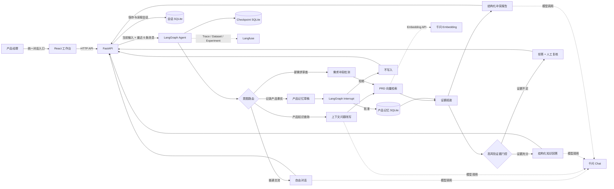
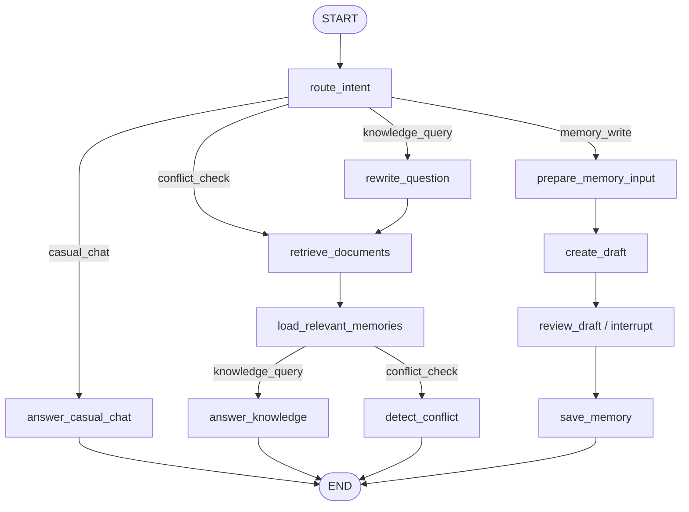

# 产品知识与决策记忆 Agent 架构

## 系统架构



## LangGraph 工作流



## 三类记忆

| 类型 | 存储位置 | 作用 |
| --- | --- | --- |
| 会话上下文 | Web SQLite | 保存对话；最近 6 条消息进入路由、自由对话和问题改写 |
| 产品显式记忆 | Product Memory SQLite | 保存经人工审批的产品状态、决策、约束和历史事实 |
| 工作流状态 | LangGraph Checkpoint SQLite | 保存节点状态和 Interrupt，支持审批流程恢复 |

## 一次知识追问的执行示例

```text
用户：小憩状态做了吗？
Agent：尚未开发上线，但已完成需求设计。

用户：那前台怎么展示？
最近会话 + 当前输入
→ 改写为“需求文档中小憩状态在前台如何设计展示？”
→ 检索 PRD 与产品记忆
→ 返回坐席侧状态颜色、切换入口、同步与调度逻辑
```

## 可观测与评测

Langfuse 记录：

- 用户输入、路由结果和问题改写。
- LangGraph 节点执行路径。
- 模型调用、检索证据、结构化输出、延迟和 token。
- Dataset 与 Experiment 结果。
- 拒答准确率、人工复核准确率、来源召回率、要点覆盖率和 Groundedness。

